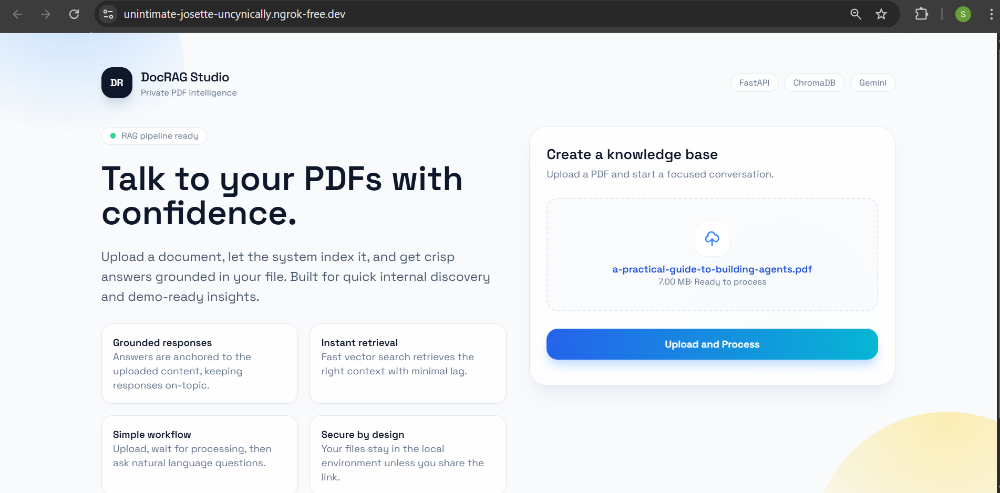
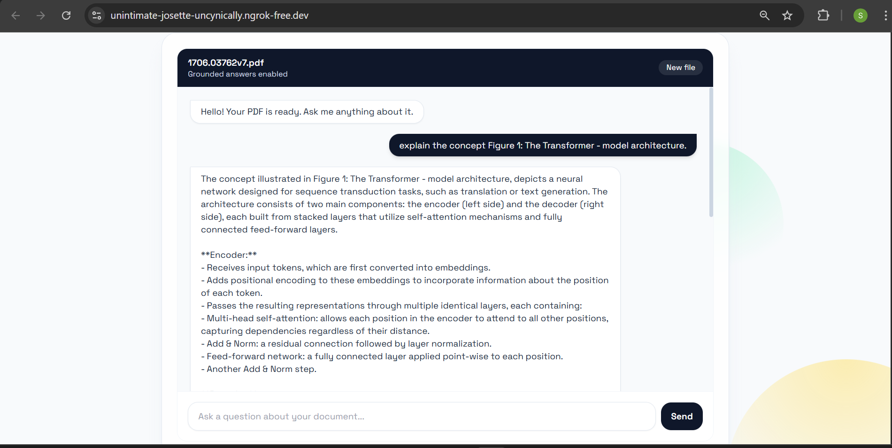
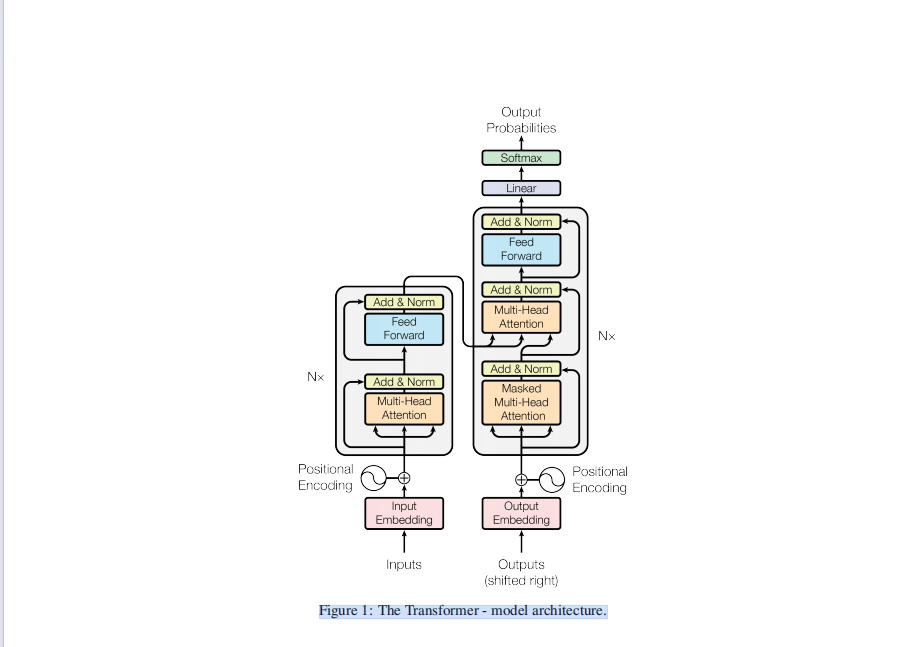

# 🧠 DocRAG Studio — Multi-Model RAG

> **Talk to your PDFs with confidence.**  
> Upload a document, let the system index it, and get crisp answers grounded in your file. Built for quick internal discovery and demo-ready insights.

---

## 📸 Screenshots

### Upload & Process


### Chat Interface


### Example: Multimodal Understanding (Transformer Diagram)
> The system correctly answers questions about diagrams and figures embedded in PDFs.



---

## 🚀 What is this?

**DocRAG Studio** is a Retrieval-Augmented Generation (RAG) system that allows you to upload a PDF and ask natural language questions about its contents — including **Multimodal(Images,Texts)** inside the document.

It uses:
- **Unstructured** for high-resolution PDF parsing (text, tables, embedded images)
- **OpenAI GPT-4.1-nano** for AI-enhanced chunk summarisation and question answering
- **OpenAI `text-embedding-3-small`** for vector embeddings
- **ChromaDB** as the local vector store
- **LangChain** to wire everything together
- **FastAPI + Jinja2** for the web interface
- **ngrok** for public URL tunnelling (useful for Colab / remote environments)

---

## 🏗️ Architecture & Pipeline

```
PDF Upload
    │
    ▼
┌─────────────────────────────────────┐
│  STEP 1: Partition (Unstructured)   │
│  - hi_res strategy                  │
│  - Extracts text, tables, images    │
└──────────────────┬──────────────────┘
                   │
                   ▼
┌─────────────────────────────────────┐
│  STEP 2: Chunk (chunk_by_title)     │
│  - Max 3000 chars per chunk         │
│  - Smart title-based splitting      │
└──────────────────┬──────────────────┘
                   │
                   ▼
┌─────────────────────────────────────┐
│  STEP 3: AI Summarisation (GPT)     │
│  - Creates searchable descriptions  │
│  - Handles text + tables + images   │
└──────────────────┬──────────────────┘
                   │
                   ▼
┌─────────────────────────────────────┐
│  STEP 4: Vector Store (ChromaDB)    │
│  - Embeds with text-embedding-3-small│
│  - Persisted locally on disk        │
└──────────────────┬──────────────────┘
                   │
                   ▼
         User Query via Chat UI
                   │
                   ▼
┌─────────────────────────────────────┐
│  Retrieval + Multimodal Answer Gen  │
│  - Top-k semantic search            │
│  - GPT answers with text + images   │
└─────────────────────────────────────┘
```

---

## 📁 Project Structure

```
Multi_Model_RAG/
├── main.py                    # FastAPI app with upload & chat endpoints
├── rag_connector.py           # Core RAG pipeline (partition → chunk → embed → retrieve)
├── requirments.python.txt     # Python package dependencies
├── requirments.linux.txt      # System-level dependencies (Linux/Colab)
├── templates/                 # Jinja2 HTML templates
├── uploads/                   # Uploaded PDFs are stored here
├── screenshots/               # UI screenshots
│   ├── file_upload.png
│   ├── chat_area.png
│   └── tranformer_diagram.png
└── .env                       # API keys and config (not committed)
```

---

## ⚙️ Setup & Installation

### 1. System Dependencies (Linux / Google Colab)

```bash
apt-get install poppler-utils tesseract-ocr libmagic-dev libgl1
sudo apt-get install -y libgl1 libglib2.0-0 libsm6 libxrender1 libxext6
```

### 2. Python Dependencies

```bash
pip install -r requirments.python.txt
```

Which installs:
```
unstructured[all-docs]
langchain_chroma
langchain
langchain-community
langchain-openai
python_dotenv
openai
```

### 3. Environment Variables

Create a `.env` file in the project root:

```env
OPENAI_API_KEY=sk-...
CHROMA_DB_NAME=chroma_db
CHROMA_COLLECTION_NAME=my_collection
NGROK_AUTH_TOKEN=your_ngrok_token
```

| Variable               | Description                                      |
|------------------------|--------------------------------------------------|
| `OPENAI_API_KEY`       | Your OpenAI API key                              |
| `CHROMA_DB_NAME`       | Directory name for ChromaDB persistence          |
| `CHROMA_COLLECTION_NAME` | Collection name inside ChromaDB               |
| `NGROK_AUTH_TOKEN`     | ngrok token for public URL (optional for local)  |

---

## ▶️ Running the App

```bash
python main.py
```

The server starts on `http://127.0.0.1:8000` with hot-reload enabled. If ngrok is configured, a public URL will also be printed to the console:

```
🚀 PUBLIC URL: https://xxxx.ngrok-free.app
```

---

## 🔌 API Endpoints

| Method | Endpoint  | Description                          |
|--------|-----------|--------------------------------------|
| `GET`  | `/`       | Renders the main web UI              |
| `POST` | `/upload` | Uploads a PDF and runs the RAG pipeline |
| `POST` | `/chat`   | Sends a question, returns an AI answer |

### `/upload` — Request
- **Content-Type**: `multipart/form-data`
- **Field**: `file` — A `.pdf` file

### `/upload` — Response
```json
{
  "status": "success",
  "message": "uploaded successfully and processes successfully",
  "filename": "your_document.pdf"
}
```

### `/chat` — Request
```json
{
  "message": "What does Figure 1 show?"
}
```

### `/chat` — Response
```json
{
  "response": "Figure 1 shows the Transformer model architecture..."
}
```

---

## 🧩 Key Components

### `rag_connector.py`

| Function                        | Description                                                  |
|---------------------------------|--------------------------------------------------------------|
| `partition_document(file_path)` | Extracts text, tables, and images from a PDF using `hi_res` |
| `create_chunks_by_title(elements)` | Splits content into smart, title-aware chunks            |
| `summarise_chunks(chunks)`      | Generates AI-enhanced, searchable descriptions per chunk     |
| `create_vector_store(documents)`| Embeds documents and stores them in ChromaDB                 |
| `run_complete_ingestion_pipeline(pdf_path)` | Runs all 4 steps end-to-end                  |
| `generate_final_answer(db, query)` | Retrieves top-k chunks and generates a multimodal answer  |

---

## 💡 How Multimodal RAG Works

Unlike basic RAG that only processes text, this pipeline:

1. **Extracts images and tables** from PDFs at ingestion time (stored as base64)
2. **Summarises mixed chunks** — when a chunk contains a table or image, GPT-4 generates a rich textual description that makes it retrievable via semantic search
3. **Answers with full context** — at query time, retrieved chunks pass their text, tables (HTML), *and* images directly to the LLM, enabling answers that reference diagrams and figures

---

## 🛠️ Tech Stack

| Layer         | Technology                        |
|---------------|-----------------------------------|
| PDF Parsing   | `unstructured` (hi_res strategy)  |
| Chunking      | `chunk_by_title`                  |
| LLM           | OpenAI `gpt-4.1-nano`             |
| Embeddings    | OpenAI `text-embedding-3-small`   |
| Vector Store  | ChromaDB (cosine similarity)      |
| Orchestration | LangChain                         |
| Web Framework | FastAPI + Jinja2                  |
| Tunnelling    | ngrok (via pyngrok)               |

---

## 📝 Notes

- Only **PDF** files are supported for upload.
- The vector store is **persisted locally** to disk under the `CHROMA_DB_NAME` directory.
- Each new upload creates/overwrites the vector store — one document is active at a time.
- For production use, replace ngrok with a proper reverse proxy (nginx, Caddy, etc.).
